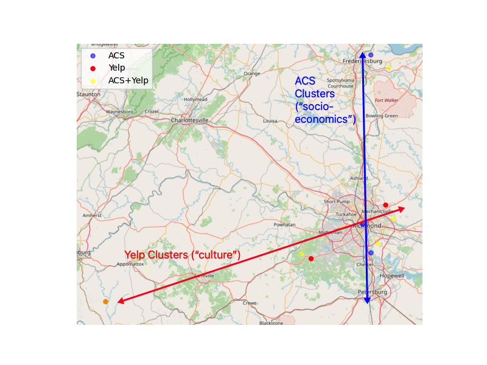

# va_clusters

An excellent article by [Dwayne Yancey in Cardinal News](https://cardinalnews.org/2023/10/11/10-important-things-about-this-years-virginia-elections/) got me thinking about the politics and geography of Virginia. I realized that despite growing up in Virginia and spending my whole life except for two years here, I didn't know that much about the state outside where I'd lived (Northern and Central Virginia). I became especially curious about pockets of cultural and economic diversity in Virginia's regions.

So for a school project, I decided to use data by Virginia census tract to find clusters of commonality based on cultural and socio-economic characteristics. Here's a really brief summary. ([This paper](https://github.com/Charlie-Kramer/va_clusters/blob/main/Va_clusters.pdf) has all the technical details in it, if you're interested). 

I measured 'culture' from Yelp using the average distance from the middle of each tract to the closest restaurants that had (a) a vegetarian-friendly menu or (b) gender-neutral restrooms, and 'socioeconomics' using about 180 variables from the Census American Community Survey. I then looked for 'clusters' of tracts with similar values for these variables, without any consideration of where in Virginia they were located geographically. (For example, one cluster might be tracts with high income that are far from gender-neutral restrooms.)

I ran each of these separately and found something interesting. For each of the two data sources, I calculated three clusters, then looked at where the corresponding tracts were located. Check out the picture below--the Yelp clusters run roughly West-East while the Census clusters run North-South. Are there distinct 'culture' and 'socioeconomic' gradients in Virginia?

So I combined both sources and found a total of five clusters, then mapped them onto Virginia:

