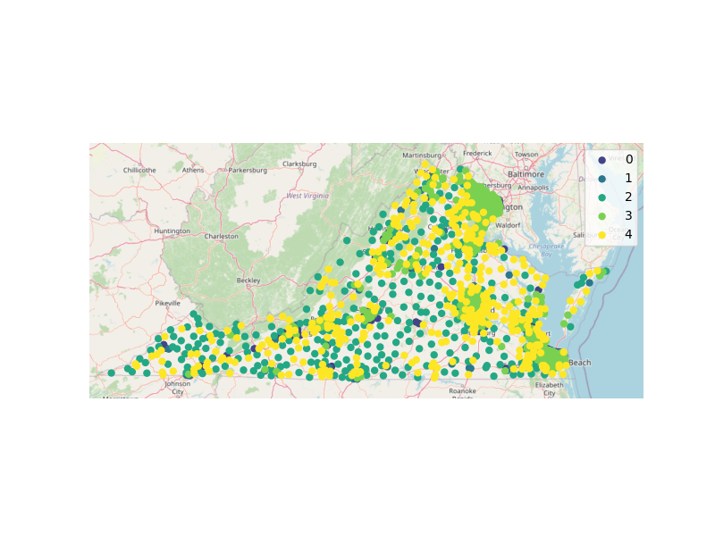

# va_clusters

An excellent article by [Dwayne Yancey in Cardinal News](https://cardinalnews.org/2023/10/11/10-important-things-about-this-years-virginia-elections/) got me thinking about the politics and geography of Virginia. I realized that despite growing up in Virginia and spending my whole life except for two years here, I didn't know that much about the state outside where I'd lived (Northern and Central Virginia). I became especially curious about pockets of cultural and economic diversity in Virginia's regions.

So for a school project, I decided to use data by Virginia census tract to find clusters of commonality based on cultural and socio-economic characteristics. Here's a really brief summary. ([This paper](https://github.com/Charlie-Kramer/va_clusters/blob/main/Va_clusters.pdf) has all the technical details in it, if you're interested). 

I measured 'culture' from Yelp using the average distance from the middle of each tract to the closest restaurants that had (a) a vegetarian-friendly menu or (b) gender-neutral restrooms, and 'socioeconomics' using about 180 variables from the Census American Community Survey. I then looked for 'clusters' of tracts with similar values for these variables, without any consideration of where in Virginia they were located geographically. (For example, one cluster might be tracts with high income that are far from gender-neutral restrooms.)

I ran each of these separately and found something interesting. For each of the two data sources, I calculated three clusters, then looked at where the corresponding tracts were centered. Check out the picture below--the Yelp clusters are centered along a line that runs roughly West-East while the Census clusters are centered along a line that runs North-South. Are there distinct 'culture' and 'socioeconomic' gradients in Virginia? It's also interesting that the cluster centers are around Virginia's geographic center of population--e.g. the 'balance point' if you made a map of Virginia and put a weight on it where each person lived--this center is just outside Richmond. 

So I combined both sources and found a total of five clusters, then mapped them onto Virginia. What's interesting to me about this picture is that while you can find definite tendencies for certain types of clusters to appear in say Southside Virginia versus Central Virginia, there's also some diversity in those regions. In other words, not all the (say) Cluster 0 tracts are concentrated in one region. These are the small pockets of diversity I was thinking about. 

This picture shows the regional diversity of clusters more clearly. Each region had characteristic clusters, but each of them contains at least a few of every cluster. 

 

In the full paper I dive a little deeper, looking into the differences across clusters (e.g. income distribution, same-sex households, Medicaid coverage and so forth). 

I feel like this could be the springboard for something more substantial. Reach out if you have ideas! Also, all the code is banked in this repo (I didn't bank the Yelp data because the API asks you not to do that, and the ACS data is pretty large and in any event easy to get).

